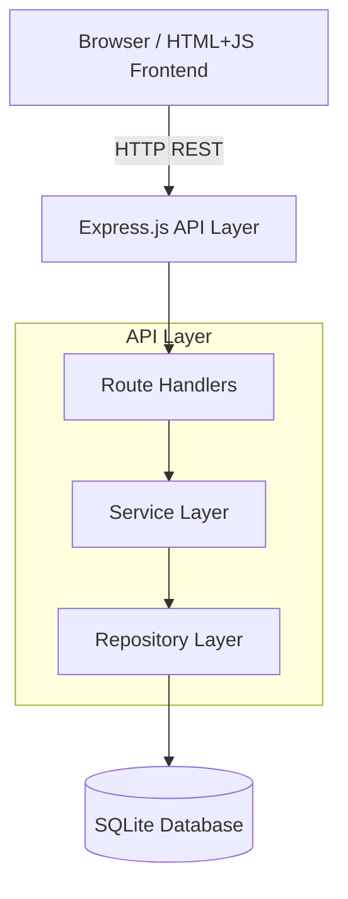
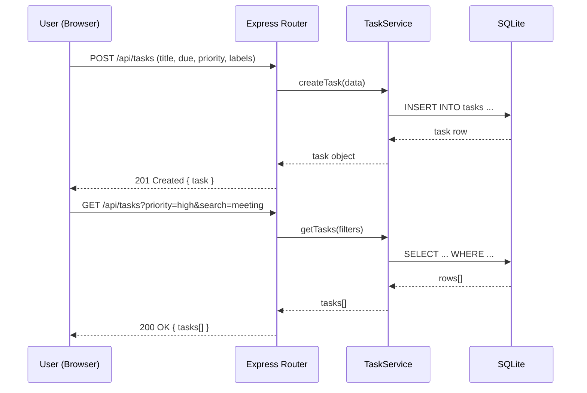
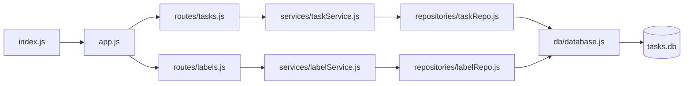
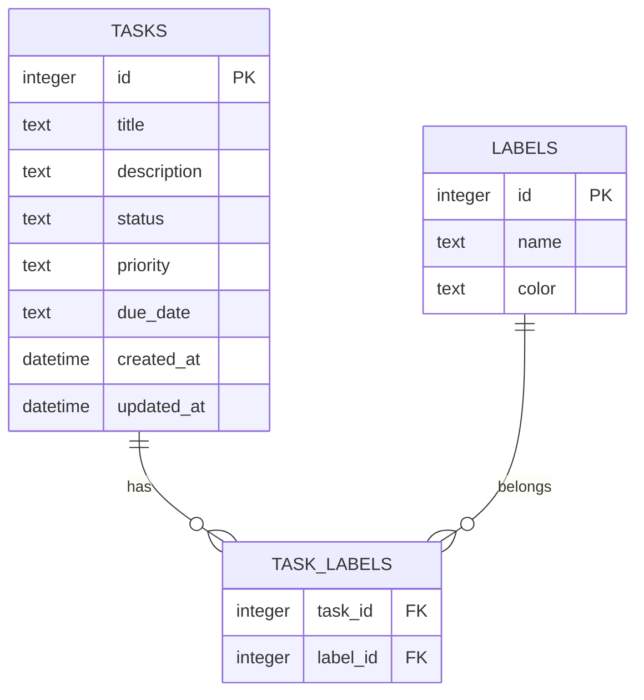

# Architecture — Personal Task Tracker

## Давхаргын бүтэц (Layered Architecture)

## Data Flow диаграм

## Module бүтэц

## Module тайлбар

| Module | Файл | Үүрэг |
|--------|------|-------|
| Entry point | `index.js` | Server эхлүүлэх, port listen |
| App config | `app.js` | Express middleware, routes холбох |
| Task routes | `routes/tasks.js` | CRUD endpoints |
| Label routes | `routes/labels.js` | Label CRUD |
| Task service | `services/taskService.js` | Бизнесийн логик, validation |
| Label service | `services/labelService.js` | Label логик |
| Task repo | `repositories/taskRepo.js` | DB query-ууд |
| Label repo | `repositories/labelRepo.js` | Label DB query |
| Database | `db/database.js` | SQLite connection, schema init |

## Database Schema

