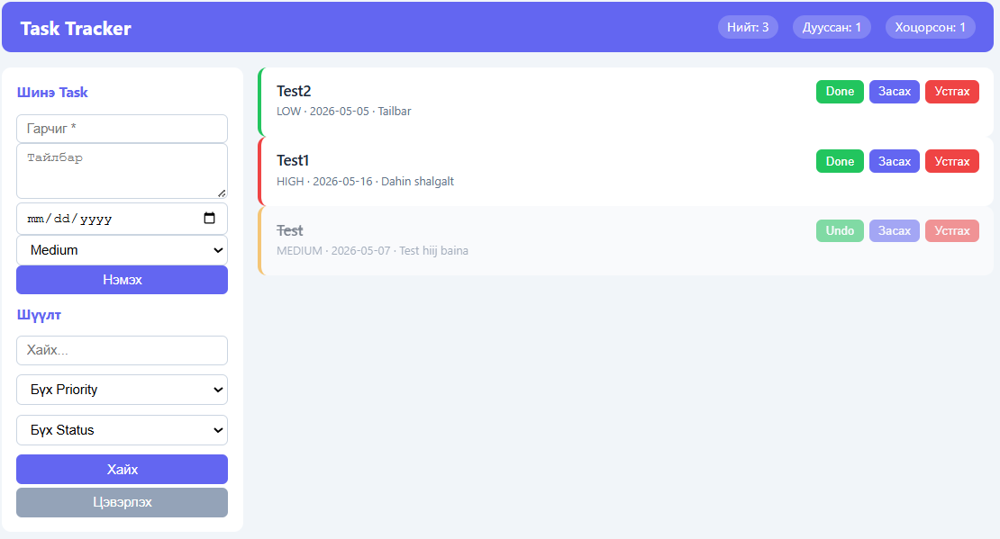

# Personal Task Tracker — Part B (Build)

REST API + vanilla JS frontend. Node.js + Express + SQLite.

## Frontend харагдах байдал



### UI тайлбар

**Дээд хэсэг (Header):**
- Апп-ийн нэр болон бодит цагийн статистик — Нийт: 3, Дууссан: 1, Хоцорсон: 1

**Зүүн тал (Sidebar):**
- **Шинэ Task форм** — гарчиг, тайлбар, огноо, priority (Medium/High/Low) сонгоод "Нэмэх" товч дарна
- **Шүүлт** — нэрээр хайх, priority болон status-аар шүүх, "Цэвэрлэх" товч бүх шүүлтийг арилгана

**Баруун тал (Task карт бүр):**
- Зүүн ирмэгийн өнгө priority-г илтгэнэ — 🟢 ногоон = low, 🟡 шар = medium, 🔴 улаан = high
- Task-ийн гарчиг, priority, due date, тайлбар харагдана
- **Done** — task-ийг дуусгавар болгоно (гарчиг зураасдана, Undo болж өөрчлөгдөнө)
- **Засах** — modal цонх нээгдэж бүх талбарыг засварлана
- **Устгах** — баталгаа асуугаад task-ийг бүрмөсөн устгана

## Суурилуулах & Ажиллуулах

```bash
npm install
npm run dev      # nodemon auto-restart
npm start        # production
```

Нээх: http://localhost:3000

## Тест

```bash
npm test               # бүх тест
npm run test:coverage  # coverage report
```

## Folder бүтэц

```
src/
├── index.js              # entry point
├── app.js                # Express app, middleware
├── db/database.js        # SQLite холболт + schema
├── routes/
│   ├── tasks.js          # Task CRUD + label assign
│   ├── labels.js         # Label CRUD
│   └── stats.js          # Statistics
├── services/
│   ├── taskService.js    # validation, бизнес логик
│   └── labelService.js
├── repositories/
│   ├── taskRepo.js       # SQL queries
│   ├── labelRepo.js
│   └── statsRepo.js
└── public/               # Frontend
    ├── index.html
    ├── style.css
    └── app.js
tests/
├── tasks.test.js
├── labels.test.js
└── stats.test.js
```

## API Endpoints

### Tasks
| Method | URL | Тайлбар |
|--------|-----|---------|
| GET | `/api/tasks` | Жагсаалт (search, priority, status, label filter) |
| POST | `/api/tasks` | Үүсгэх |
| GET | `/api/tasks/:id` | Нэгийг авах |
| PUT | `/api/tasks/:id` | Засах |
| DELETE | `/api/tasks/:id` | Устгах |
| POST | `/api/tasks/:id/labels/:labelId` | Label нэмэх |
| DELETE | `/api/tasks/:id/labels/:labelId` | Label хасах |

### Labels
| Method | URL | Тайлбар |
|--------|-----|---------|
| GET | `/api/labels` | Бүх label |
| POST | `/api/labels` | Үүсгэх |
| PUT | `/api/labels/:id` | Засах |
| DELETE | `/api/labels/:id` | Устгах |

### Stats
| Method | URL | Тайлбар |
|--------|-----|---------|
| GET | `/api/stats` | Нийт/дууссан/хоцорсон/priority тоо |

## Task объект

```json
{
  "id": 1,
  "title": "Meeting бэлдэх",
  "description": "",
  "status": "pending",
  "priority": "high",
  "due_date": "2026-05-10",
  "created_at": "2026-05-06T08:00:00",
  "updated_at": "2026-05-06T08:00:00",
  "labels": [{ "id": 1, "name": "work", "color": "#6366f1" }]
}
```

## Filter жишээ

```
GET /api/tasks?search=meeting&priority=high&status=pending
GET /api/tasks?label=work
```
